# SessionManager-MinimumPrivilege
Systems Manager - Session Managerを利用する場合の最小権限の確認
</img>

# 検証手順
## (1)事前設定
### (1)-(a) 作業環境の準備
下記を準備します。
* bashが利用可能な環境(LinuxやMacの環境)
* aws-cliのセットアップ
* AdministratorAccessポリシーが付与され実行可能な、aws-cliのProfileの設定

### (1)-(b) gitのclone
```shell
git clone https://github.com/Noppy/SessionManager-MinimumPrivilege.git
cd SessionManager-MinimumPrivilege
```

### (1)-(c) CLI実行用の事前準備
これ以降のAWS-CLIで共通で利用するパラメータを環境変数で設定しておきます。
```shell
export PROFILE=<Fargaeを動かすComputeAccount用のプロファイルを指定>
export REGION=<デプロイ先のリージョン>

#プロファイルの動作テスト
aws --profile ${PROFILE} sts get-caller-identity

```

## (2)環境の準備
### (2)-(a) SessionManager設定
#### (i) Session Managerログ出力用LogGroup & S3バケット作成
暗号用のKMS-CMKと、Session Managerログ出力用のロググループとS3バケットを作成します。
```shell
aws --profile ${PROFILE} --region ${REGION} \
    cloudformation create-stack \
        --stack-name SSMTestS3Logs \
        --template-body "file://./src/s3_logs_kms_for_ssm.yaml"
```
#### (ii) Session Manager設定
セッションマネージャの設定をします。この設定はCloudFormation未対応なためCLIで実施します。
```shell
#S3バケット名とロググループ名の取得
BucketName=$(aws --profile ${PROFILE} --region ${REGION} --output text \
    cloudformation describe-stacks \
        --stack-name SSMTestS3Logs \
        --query 'Stacks[].Outputs[?OutputKey==`BucketName`].[OutputValue]')
LogGroup=$(aws --profile ${PROFILE} --region ${REGION} --output text \
    cloudformation describe-stacks \
        --stack-name SSMTestS3Logs \
        --query 'Stacks[].Outputs[?OutputKey==`LogGroupId`].[OutputValue]')
echo "
BucketName = ${BucketName}
LogGroup   = ${LogGroup}
"

#定義情報の設定
SessionManagerRunShellJson='{
  "schemaVersion": "1.0",
  "description": "Document to hold regional settings for Session Manager",
  "sessionType": "Standard_Stream",
  "inputs": {
    "s3BucketName": "'"${BucketName}"'",
    "s3KeyPrefix": "",
    "s3EncryptionEnabled": true,
    "cloudWatchLogGroupName": "'"${LogGroup}"'",
    "cloudWatchEncryptionEnabled": true,
    "idleSessionTimeout": "60",
    "maxSessionDuration": "",
    "cloudWatchStreamingEnabled": true,
    "kmsKeyId": "",
    "runAsEnabled": false,
    "runAsDefaultUser": "",
    "shellProfile": {
      "windows": "",
      "linux": ""
    }
  }
}'

#設定の適用
aws --profile ${PROFILE} --region ${REGION} \
  ssm update-document \
    --name "SSM-SessionManagerRunShell" \
    --content "${SessionManagerRunShellJson}" \
    --document-version "\$LATEST"

```
- 参考情報
  - [Session Manager 設定の更新 (コマンドライン)](https://docs.aws.amazon.com/ja_jp/systems-manager/latest/userguide/getting-started-configure-preferences-cli.html)

### (2)-(b) VPC作成
```shell
aws --profile ${PROFILE} --region ${REGION} \
    cloudformation create-stack \
        --stack-name SSMTestVPC \
        --template-body "file://./src/vpc-2az-4subnets.yaml" \
        --parameters "file://./src/SSmTestVpc.json" \
        --capabilities CAPABILITY_IAM ;
```
### (2)-(c) VPCエンドポイント作成
```shell
aws --profile ${PROFILE} --region ${REGION} \
    cloudformation create-stack \
        --stack-name SSMTestVpce \
        --template-body "file://./src/vpce-allowall.yaml"
```

### (2)-(d) インスタンス作成
```shell
KEYNAME="CHANGE_KEY_PAIR_NAME"  #環境に合わせてキーペア名を設定してください。
```
```shell
#最新のAmazon Linux2のAMI IDを取得します。
AMIID=$(aws --profile ${PROFILE} --region ${REGION} --output text \
    ec2 describe-images \
        --owners amazon \
        --filters 'Name=name,Values=amzn2-ami-hvm-2.0.????????.?-x86_64-gp2' \
                  'Name=state,Values=available' \
        --query 'reverse(sort_by(Images, &CreationDate))[:1].ImageId' ) ;

#Clientインスタンス作成
CFN_STACK_PARAMETERS='
[
  {
    "ParameterKey": "AmiId",
    "ParameterValue": "'"${AMIID}"'"
  },
  {
    "ParameterKey": "KeyName",
    "ParameterValue": "'"${KEYNAME}"'"
  }
]'

aws --profile ${PROFILE} --region ${REGION} \
    cloudformation create-stack \
        --stack-name SSMTestInstances \
        --template-body "file://./src/bastion_and_testinstance.yaml" \
        --parameters "${CFN_STACK_PARAMETERS}" \
        --capabilities CAPABILITY_IAM ;
```
## (3)SSM疎通確認
### (3)-(a) SSH接続
SSM Agentのモニタリングのため予めSSHでログインしておきます。
- 作業端末からBastionにSSH接続する
```shell
#BastionとSSMインスタンスのIPを確認する
aws --profile ${PROFILE} --region ${REGION} \
    cloudformation describe-stacks \
        --stack-name SSMTestInstances  \
        --query 'Stacks[].Outputs'

#SSHでBastionに接続
ssh-add
ssh -A ec2-user@<上記で確認したBastionのPublic IPアドレス>
```
- BastionからSsmTestインスタンスに接続し、SsmtestのAWS CLIの初期設定をする
```shell
#Bastionサーバ
ssh <上記で確認したSsmのPrivate IPアドレス>

# Setup AWS CLI
REGION=$(curl -s http://169.254.169.254/latest/meta-data/placement/availability-zone | sed -e 's/.$//')
aws configure set region ${REGION}
aws configure set output json
```
### (3)-(b) SSMのVPCE経由の疎通確認
Session Managerで接続できることを確認する。
- 作業端末のブラウザなどからマネコンで、SsmTestに対してSession Manager接続する
- SSM AgentのモニタリングはSSHした端末で確認。確認は下記ログで行う(要root権限)
  - `/var/log/amazon/ssm/amazon-ssm-agent.log`
  - `/var/log/amazon/ssm/errors.log`

## (4)VPCE挙動の確認
### (4)-(a) VPCEがssmだけ
```shell
# CloudFormationをデプロイした端末で以下を実行
aws --profile ${PROFILE} --region ${REGION} \
    cloudformation update-stack \
        --stack-name SSMTestVpce \
        --template-body "file://./src/vpce-ssm_only.yaml"
```
- 挙動
  - Fleet Manager: `Online`
  - Run Command: `NG`
  - 情報収集: `NG`
  - Session Manager
    - ログ出力なし: `NG`
    - ログ出力(logs): `NG`
    - ログ出力(s3): `NG`

### (4)-(b) VPCEがssm/ssmmessages
```shell
# CloudFormationをデプロイした端末で以下を実行
aws --profile ${PROFILE} --region ${REGION} \
    cloudformation update-stack \
        --stack-name SSMTestVpce \
        --template-body "file://./src/vpce-ssm_ssmmes.yaml"
```
- 挙動
  - Fleet Manager: `Online`
  - Run Command: `NG`
  - 情報収集: `一部機能のみ稼働`
  - Session Manager
    - ログ出力なし: `OK`
    - ログ出力(logs): `NG`
    - ログ出力(s3): `NG`

### (4)-(c) VPCEがssm/ec2messageだけ
```shell
# CloudFormationをデプロイした端末で以下を実行
aws --profile ${PROFILE} --region ${REGION} \
    cloudformation update-stack \
        --stack-name SSMTestVpce \
        --template-body "file://./src/vpce-ssm_ec2message.yaml"
```
- 挙動
  - Fleet Manager: `Online`
  - Run Command: `OK`
  - 情報収集: `NG`
  - Session Manager
    - ログ出力なし: `NG`
    - ログ出力(logs): `NG`
    - ログ出力(s3): `NG`
### (4)-(d) VPCEがssm/ec2message/ssmmessage
```shell
# CloudFormationをデプロイした端末で以下を実行
aws --profile ${PROFILE} --region ${REGION} \
    cloudformation update-stack \
        --stack-name SSMTestVpce \
        --template-body "file://./src/vpce-ssm_ec2message_ssmmessage.yaml"
```
- 挙動
  - Fleet Manager: `Online`
  - Run Command: `OK`
  - 情報収集: `NG`
  - Session Manager
    - ログ出力なし: `OK`
    - ログ出力(logs): `NG`
    - ログ出力(s3): `NG`

### (4)-(e) VPCEがssm/ec2message/ssmmessage/logs/s3
```shell
# CloudFormationをデプロイした端末で以下を実行
aws --profile ${PROFILE} --region ${REGION} \
    cloudformation update-stack \
        --stack-name SSMTestVpce \
        --template-body "file://./src/vpce-allowall.yaml"
```
- 挙動
  - Fleet Manager: `Online`
  - Run Command: `OK`
  - 情報収集: `OK` -> S3バケットが必要
  - Session Manager
    - ログ出力なし: `OK`
    - ログ出力(logs): `OK`
    - ログ出力(s3): `OK`

### (4)-(f) VPCEがssm/ec2message/ssmmessage/logs/s3 + SSMセッションのKMS暗号化
#### (i)SSMセッションのKMS暗号化の有効化
- CloudFormation操作用の端末で以下を実行し設定を変更
```shell
#S3バケット名とロググループ名の取得
BucketName=$(aws --profile ${PROFILE} --region ${REGION} --output text \
    cloudformation describe-stacks \
        --stack-name SSMTestS3Logs \
        --query 'Stacks[].Outputs[?OutputKey==`BucketName`].[OutputValue]')
LogGroup=$(aws --profile ${PROFILE} --region ${REGION} --output text \
    cloudformation describe-stacks \
        --stack-name SSMTestS3Logs \
        --query 'Stacks[].Outputs[?OutputKey==`LogGroupId`].[OutputValue]')
KmsKeyId=$(aws --profile ${PROFILE} --region ${REGION} --output text \
    cloudformation describe-stacks \
        --stack-name SSMTestS3Logs \
        --query 'Stacks[].Outputs[?OutputKey==`KeyId`].[OutputValue]')
echo "
BucketName = ${BucketName}
LogGroup   = ${LogGroup}
KmsKeyId   = ${KmsKeyId}
"

#定義情報の設定
SessionManagerRunShellJson='{
  "schemaVersion": "1.0",
  "description": "Document to hold regional settings for Session Manager",
  "sessionType": "Standard_Stream",
  "inputs": {
    "s3BucketName": "'"${BucketName}"'",
    "s3KeyPrefix": "",
    "s3EncryptionEnabled": true,
    "cloudWatchLogGroupName": "'"${LogGroup}"'",
    "cloudWatchEncryptionEnabled": true,
    "idleSessionTimeout": "60",
    "maxSessionDuration": "",
    "cloudWatchStreamingEnabled": true,
    "kmsKeyId": "'"${KmsKeyId}"'",
    "runAsEnabled": false,
    "runAsDefaultUser": "",
    "shellProfile": {
      "windows": "",
      "linux": ""
    }
  }
}'

#設定の適用
aws --profile ${PROFILE} --region ${REGION} \
  ssm update-document \
    --name "SSM-SessionManagerRunShell" \
    --content "${SessionManagerRunShellJson}" \
    --document-version "\$LATEST"

```

#### (ii)VPCE KMSがない状態でSSM接続を確認
- 挙動
  - Fleet Manager: `Online`
  - Run Command: `OK`
  - 情報収集: `NG`
  - Session Manager
    - ログ出力(logs): `NG`
    - ログ出力(s3): `NG`


#### (iii)VPCE KMS追加
```shell
# CloudFormationをデプロイした端末で以下を実行
aws --profile ${PROFILE} --region ${REGION} \
    cloudformation update-stack \
        --stack-name SSMTestVpce \
        --template-body "file://./src/vpce-ssm_ec2mes_ssmmes_logs_s3_kms.yaml"
```
- 挙動
  - Fleet Manager: `Online`
  - Run Command: `OK`
  - 情報収集: `OK`
  - Session Manager
    - ログ出力(logs): `OK`
    - ログ出力(s3): `OK`

#### (iii)Session ManagerとVPCEの設定戻し
- Session Manager設定: `(2)-(a)の(ii)`でKMS暗号設定を無効化する
- VPCエンドポイント: 下記コマンドでkmsのVPCEを解除
```shell
aws --profile ${PROFILE} --region ${REGION} \
    cloudformation update-stack \
        --stack-name SSMTestVpce \
        --template-body "file://./src/vpce-allowall.yaml"
```


## (5)セキュリティリスクシナリオの確認
Systems Managerのハイブリットアクティベーション機能を利用し、不正なAWSアカウントのSSMにVPCエンドポイント経由でSSM接続し、セッションマネージャで不正アクセスするシナリオを再現します。
### (5)-(a) 不正アカウントでSystems Managerのハイブリットアクティベーション作成
手元の作業PCで以下の手順で、不正なAWSアカウントにハイブリットアクティベーションを作成します。
#### (5)-(a)-(i)事前準備
```shell
UNAUTH_PROFILE="<不正アカウントのAdmin権限のあるプロファイルを指定>"
UNAUTH_REGION="${REGION}"
```
#### (5)-(a)-(ii)ハイブリットアクティベーション用のIAMロール作成
```shell
#必要情報の取得
AccountID=$(aws --profile ${OTHER_PROFILE} --output text sts get-caller-identity --query 'Account')

# ハイブリットアクティベーション用のロール作成
ASSUME_ROLE_JSON='{
   "Version":"2012-10-17",
   "Statement":[
      {
         "Sid":"",
         "Effect":"Allow",
         "Principal":{
            "Service":"ssm.amazonaws.com"
         },
         "Action":"sts:AssumeRole",
         "Condition":{
            "StringEquals":{
               "aws:SourceAccount":"'"${AccountID}"'"
            },
            "ArnEquals":{
               "aws:SourceArn":"arn:aws:ssm:'"${OTHER_REGION}"':'"${AccountID}"':*"
            }
         }
      }
   ]
}'
# ロール作成
aws --profile ${UNAUTH_PROFILE} \
    iam create-role \
        --role-name "SSMActivationServiceRole" \
        --assume-role-policy-document "${ASSUME_ROLE_JSON}" \
        --max-session-duration 43200

#Policyのアタッチ
aws --profile ${UNAUTH_PROFILE} \
    iam attach-role-policy \
        --role-name "SSMActivationServiceRole" \
        --policy-arn arn:aws:iam::aws:policy/AmazonSSMManagedInstanceCore

#Policyのアタッチ
aws --profile ${UNAUTH_PROFILE} \
    iam attach-role-policy \
        --role-name "SSMActivationServiceRole" \
        --policy-arn arn:aws:iam::aws:policy/AmazonSSMDirectoryServiceAccess

```
### (5)-(b)ハイブリットアクティベーション作成
ハイブリットアクティベーションを作成し、作成されたアクティベーションのIDとCODEを控えておきます。
```shell
aws --profile ${UNAUTH_PROFILE} --region ${UNAUTH_REGION} \
    ssm create-activation \
      --iam-role "SSMActivationServiceRole" \
      --registration-limit 10

# 上記を実行時のリターンで表示されるIDとCodeを控えておく
# {
#    "ActivationId": "xxxx",
#    "ActivationCode": "xxxxx"
# }
```
### (5)-(c)インスタンスの追加
SsmTestインスタンスのOSにログインし、上記のアクティベーション情報を利用して不正アカウントのSSMにSsmTestインスタンスを登録しいます。
```shell
#以下のコマンドは、SSMTestインスタンスにログインした状態で実行する。
ID="<アクティベーションのActivationId>"
CODE="<アクティベーションのActivationCode>"
REGION="<アクティベーションを作成したリージョン>"

#SSMエージェントの停止
sudo systemctl stop amazon-ssm-agent

#不正アカウントのアクティベーションへの登録
sudo amazon-ssm-agent -register -code "${CODE}" -id "${ID}" -region "${REGION}"

# 以下のメッセージが出力されればOK
# INFO Successfully registered the instance with AWS SSM using Managed instance-id: mi-xxxxx"

#SSMエージェント起動
sudo systemctl start amazon-ssm-agent
```
### (5)-(d)不正アカウントでの確認ンスタンスの追加
不正アカウントのマネージメントコンソールで以下ができることを確認する。
- Systems Managerのフリーとマネージャーに該当インスタンスが存在すること
- セッションマネージャで該当インスタンスにアクセス可能であること

## (6)VPCEポリシーでの防御確認
### (6)-(a)VPCエンドポイントポリシーの更新
```shell
# CloudFormationをデプロイした端末で以下を実行
aws --profile ${PROFILE} --region ${REGION} \
    cloudformation update-stack \
        --stack-name SSMTestVpce \
        --template-body "file://./src/vpce-restrict.yaml"
```
### (6)-(b)不正アカウントでアクティベーションできるか
- 不正アカウントのSSMで登録済みのインスタンスを登録解除する
- SsmTestにSSHログインした状態でアクティベーション登録を行う
- ```shell
  sudo systemctl stop amazon-ssm-agent
  sudo amazon-ssm-agent -register -code "${CODE}" -id "${ID}" -region "${REGION}"

  sudo systemctl start amazon-ssm-agent
  
  ```
- 結果
  - レジストレーションは通る
  - しかしSSM Agent起動時に権限不足でエラーとなるため不正アカウントからの利用は実質不可
  - `/var/log/amazon/ssm/amazon-ssm-agent.log`
    - ```
      2022-04-06 07:19:57 INFO [ssm-agent-worker] [StartupProcessor] Write to serial port: OsProductName: Amazon Linux
      2022-04-06 07:19:57 INFO [ssm-agent-worker] [StartupProcessor] Write to serial port: OsVersion: 2
      2022-04-06 07:19:57 INFO [ssm-agent-worker] Entering SSM Agent hibernate - AccessDeniedException: User: arn:aws:sts::xxxxxxxxxxxx:assumed-role/SSMActivationServiceRole/mi-05f208d396178669e is not authorized to perform: ssm:UpdateInstanceInformation on resource: arn:aws:ssm:ap-northeast-1:xxxxxxxxxxxx:managed-instance/mi-05f208d396178669e because no VPC endpoint policy allows the ssm:UpdateInstanceInformation action
        status code: 400, request id: c2bc9a1b-2723-4071-92be-96aa54c24bae
      ```

## (7)クライアント権限の確認
### (7)-(1)ユーザ追加
ユーザ追加
```shell
aws --profile ${PROFILE} --region ${REGION} \
  cloudformation create-stack \
    --stack-name SSMTestIamUser \
    --template-body "file://./src/ssm-user.yaml" \
    --capabilities CAPABILITY_NAMED_IAM ;
```
ユーザにアクセスキーとシークレットキー生成
```shell
aws --profile ${PROFILE} --region ${REGION} \
  iam create-access-key --user-name "SsmClientUser"
```
### (7)-(2) CLIに認証情報を設定
新しいターミナルを起動し、(7)-(1)で生成したアクセスキーとシークレットキーを環境変数に設定する
```shell
export AWS_ACCESS_KEY_ID="(7)-(1)で生成したアクセスキー"
export AWS_SECRET_ACCESS_KEY="(7)-(1)で生成したシークレットキー"
export AWS_DEFAULT_REGION="<デプロイ先のリージョン>"
```
### (7)-(3) Session Managerテスト
```shell
#SSM管理インスタンス一覧を表示
 aws ssm describe-instance-information \
  --query 'InstanceInformationList[].{InstanceId:InstanceId,SourceId:SourceId,ComputerName:ComputerName}'

#一覧からセッションマネージャ接続対象を確認して接続
aws ssm start-session --target "i-xxxxxxx(対象インスタンスのInstanceId)"
```
セッションのターミナル
```shell
#セッションを作成(バックグラウンドで起動)
aws ssm start-session --target "i-xxxxxxx(対象インスタンスのInstanceId)" &

#セッション一覧を表示
aws ssm describe-sessions --state Active

#対象セッションを終了
aws ssm terminate-session --session-id "セッションID"
```

## (8) Session ManagerのSSMトンネルテスト
### (8)-(a) SSH over SSM
#### (i)クライアントのSSHクライアント設定に書き設定を追加する
- `~/.ssh/config`
```shell
# SSH over Session Manager
host i-* mi-*
    ProxyCommand /bin/sh -c "aws --profile プロファイル --region 作成したリージョン ssm start-session --target %h --document-name AWS-StartSSHSession --parameters 'portNumber=%p'"
```
#### (ii)SSHコマンドで接続する
```shell
ssh i-xxxxxxxxx
```

### (8)-(b) PortFowarding over SSM
#### (i)SSMでOSログインして、8080ポートで簡易的なhttpサーバを建てる
```shell
sudo -i -u ec2-user

#pythonによる簡易httpサーバスクリプト
cat > server.py << EOL
from http.server import HTTPServer, CGIHTTPRequestHandler

class Handler(CGIHTTPRequestHandler):
    # CGIを設置するディレクトリ
    cgi_directories = ["/cgi-bin"]

# ポート番号
PORT = 8080

# IPアドレス
HOST = "127.0.0.1"

# URLを表示
print("http://127.0.0.1:8080/")

# サーバの起動
httpd = HTTPServer((HOST, PORT), Handler)
httpd.serve_forever()
EOL

#簡易httpサーバ起動
python3 server.py
```
#### (ii)クライアントで新しいターミナルを起動してSSM接続を行う
```shell
aws start-session \
  --target "i-xxxxxxx(対象インスタンスのInstanceId)" \
  --document-name "AWS-StartPortForwardingSession" \
  --parameters '{"portNumber":["8080"], "localPortNumber":["9999"]}'
```

#### (iii)クライアントで新しいターミナルを起動してhttp接続を確認する
```shell
curl http://127.0.0.1:9999/
````